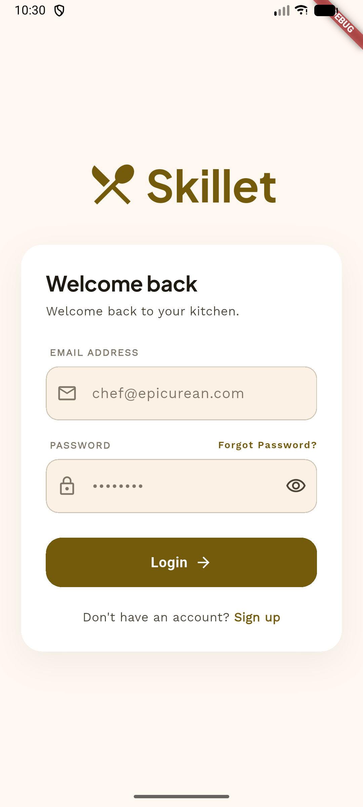

# Skillet — Recipe Creator AI

A Flutter app that turns whatever is already in your fridge into cookable recipes. You keep a
pantry inventory, tap generate, and Gemini (via Firebase AI) returns 3–5 realistic recipes that
respect your dietary needs, cooking skill, goals, and the equipment you actually own.

<p align="center">
  
</p>

## Features

- **AI recipe generation** — ingredients in, structured JSON recipes out, parsed into typed
  `Recipe` models with a retry pass when the model replies with anything but JSON.
- **Personalised prompts** — dietary preferences (vegetarian, vegan, gluten-free, keto, paleo,
  dairy-free), goal (weight loss / build muscle / healthy lifestyle), skill level, and kitchen
  equipment are folded into the prompt from the user's stored profile.
- **Fridge inventory** — add free-typed ingredients; each one is auto-categorised (Produce, Dairy
  & Eggs, Protein, Pantry) and given an emoji by the same classifier, so icon and section always
  agree. Tracks expiry and low-stock flags.
- **Match percentage** — each generated recipe is scored against what you actually have on hand,
  with common staples (salt, pepper, oil, butter, water, flour) assumed available.
- **Saved recipes & history** — save recipes, like them, and browse the last generations, all
  synced per-user in Firestore.
- **Onboarding flow** — a multi-step, skippable flow that captures goal, skill, diet, and
  equipment, then routes the user into the app.
- **Auth** — email/password sign-up, sign-in, password reset, and full account deletion (Firestore
  subcollections included).
- **10 themes** — Light, Dark, Rose Gold, Lavender Dream, Sapphire Blue, Emerald Luxe, Sunset
  Peach, Champagne Gold, Ocean Pearl, Velvet Ruby — persisted with `shared_preferences`.

## Stack

| Concern | Choice |
| --- | --- |
| Framework | Flutter (Dart SDK ^3.10.8, Flutter 3.41.6 pinned via [.fvmrc](.fvmrc)) |
| AI | `firebase_ai` → `gemini-2.5-flash-lite` |
| Auth | `firebase_auth` (email/password) |
| Data | `cloud_firestore` |
| Local prefs | `shared_preferences` |
| Type | `google_fonts` (Plus Jakarta Sans) |
| State | Plain `StatefulWidget` + `ChangeNotifier`/`InheritedNotifier`, no state-management package |

## Project layout

```
lib/
├── main.dart                  # Firebase init, ThemeController, AppThemeScope
├── firebase_options.dart      # ⚠ placeholder values — replace with your own
├── models/                    # Recipe, FridgeItem, UserProfile, SavedRecipeEntry, …
├── screens/
│   ├── home_screen.dart       # 5-tab shell: Generate, Inventory, Recipes, Saved, Profile
│   ├── fridge_screen.dart
│   ├── recipe_detail_screen.dart
│   ├── login_screen.dart / signup_screen.dart
│   ├── profile_screen.dart / theme_settings_screen.dart
│   └── onboarding/onboarding_flow.dart
├── services/                  # Firestore repositories + RecipeGenerationService + ThemeController
├── theme/                     # app_theme.dart (schemes) and app_themes.dart (10 options)
├── utils/                     # ingredient→emoji, match %, model-response parser, date format
└── widgets/                   # auth_gate.dart and home/ tiles, nav, banner
```

## Firestore data model

```
users/{uid}                      # profile: name, email, avatarId, goal, cookingSkill,
                                 #          dietaryPreferences[], equipment[], onboardingComplete
users/{uid}/inventory/{id}       # fridge items
users/{uid}/generations/{id}     # generation history (ingredients + recipes + createdAt)
users/{uid}/savedRecipes/{id}    # saved recipes with liked flag
```

Rules live in [firestore.rules](firestore.rules). Note that the shipped rules only cover the
`generations` subcollection — the `inventory`, `savedRecipes`, and profile document paths need
matching owner-only rules before this goes anywhere near production.

## Getting started

1. **Install Flutter** — this repo pins 3.41.6 via [FVM](https://fvm.app):
   ```bash
   fvm install && fvm use
   ```
2. **Create a Firebase project** and enable Email/Password auth, Cloud Firestore, and the
   Firebase AI Logic (Gemini) API.
3. **Regenerate Firebase config** — [lib/firebase_options.dart](lib/firebase_options.dart) is
   checked in with placeholder ids and will not connect as-is:
   ```bash
   dart pub global activate flutterfire_cli
   flutterfire configure
   ```
   Also drop in the platform files (`android/app/google-services.json`,
   `ios/Runner/GoogleService-Info.plist`).
4. **Deploy rules**: `firebase deploy --only firestore:rules`
5. **Run**:
   ```bash
   fvm flutter pub get
   fvm flutter run
   ```

## Tests

```bash
fvm flutter test
```

Covers the model-response parser ([test/recipe_response_parser_test.dart](test/recipe_response_parser_test.dart))
and the home-screen generate flow against a fake `RecipeGenerationService`
([test/widget_test.dart](test/widget_test.dart)).

## Design

[DESIGN.md](DESIGN.md) holds the "Epicurean Bento" design system — colour tokens and the type
scale that [lib/theme/app_theme.dart](lib/theme/app_theme.dart) implements. The
`stitch_ingredient_recipe_finder/` directories (one at the repo root, one under `test/`) hold the
generated HTML mockups and screenshots the onboarding screens were built from.
